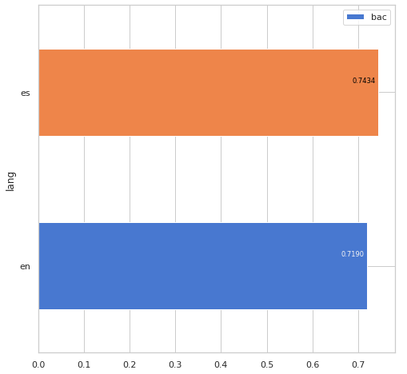
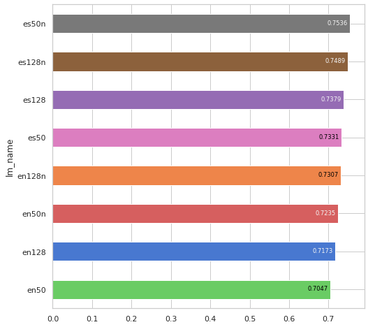
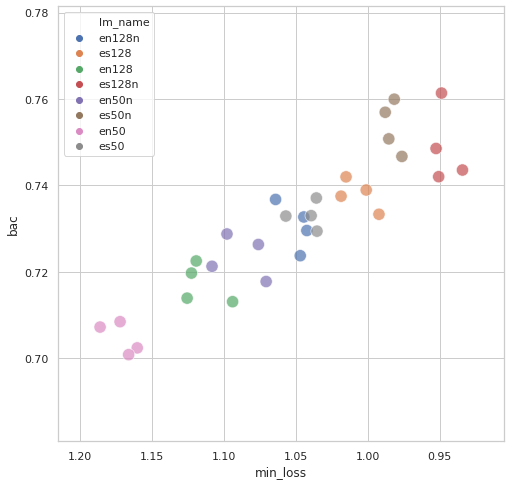
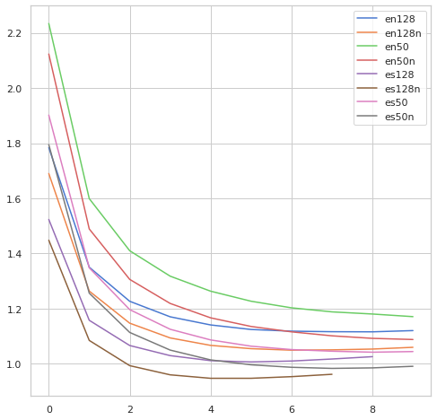
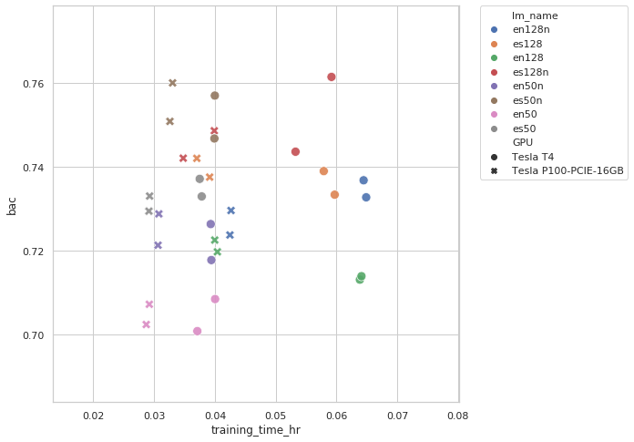

# Evaluación de Modelos de Lenguaje en Español en una Tarea de Clasificación Multiclase

## Objetivo

Realizamos una comparación entre varios modelos de lenguaje que son fácilmente reutilizables para tareas de clasificación de texto por medio de redes neuronales profundas (DNN). Estos modelos están disponibles en [Tensorflow Hub](https://tfhub.dev/s?module-type=text-embedding) y se pueden usar de forma muy simple como una capa de embeddings de texto que precede a un perceptrón multicapa (MLP). El objetivo de esta comparación es obtener un resumen de las características y ventajas de cada modelo para tareas en español. Para ello usamos como proxy una tarea simple de clasificación multiclase de textos cortos esperando que algunas de las generalidades encontradas se puedan aplicar después a otro tipo de tareas de procesamiento de lenguaje natural tales como análsis de sentimiento, similitud textual o reconocimiento de entidades nombradas. También esperamos que el modelo de clasificador pueda ser reutilizado, adaptado o ampliado a otras tareas.

## Modelos y datos

### Modelos de lenguaje

Hasta este momento hemos evaluamos modelos pertenecientes a la familia [Neural-Net Language Models](https://tfhub.dev/google/collections/nnlm/1) entrenados en el corpus Spanish Google News 50B, con embeddings de 50 y 128 dimensiones, con y sin normalización de textos. Evaluamos también los modelos equivalentes en inglés con el fin de comparar el beneficio de usar la versión de su lenguaje específico. 

Modelos evaluados. 

- nnlm-en-dim128
- nnlm-en-dim128-with-normalization
- nnlm-en-dim50
- nnlm-en-dim50-with-normalization
- nnlm-es-dim128
- nnlm-es-dim128-with-normalization
- nnlm-es-dim50
- nnlm-es-dim50-with-normalization

### Dataset y tarea de clasificación

Como tarea de clasificación se utilizó la propuesta en [MercadoLibre Data Challenge 2019](https://ml-challenge.mercadolibre.com/) la cual consiste en un dataset de 10 millones de títulos de anuncios los cuales se pueden clasificar en algo más de 1,500 categorías. Como métrica de evaluación se utiliza [Balanced Accuracy Score](https://ml-challenge.mercadolibre.com/rules) tal como se requirió en el reto original. El [dataset](https://ml-challenge.mercadolibre.com/downloads) contiene mitad de datos en español y mitad en portugués por lo que se filtró únicamente la porción en español. En la tarea de evaluación se utilizó como conjunto de entrenamiento (training set) un subconjunto aleatorio de 1,000,000 de registros con un 5% de ellos usados para validación, y 25,000 registros adicionales para el conjunto de prueba (test set).

### Arquitectura de la red neuronal

La arquitectura de la red neuronal consiste en conectar la salida de embeddings del modelo de lenguaje con 3 capas densas de 512 unidades las dos primeras y el número de clases en la capa final, con Dropout entre cada una de ellas. Se entrenó con optimizador Adam con valores default y como pérdida (loss) se utilizó Sparse Categorical Crossentropy. El batch size en el entrenamiento se mantuvo constante en 4096. Se entrenó por un máximo de 10 épocas pero con EarlyStopping con paciencia==3 por lo que el entrenamiento terminó antes en varios casos. No se hizo otro tipo de optimización de hiperparámetros ya que el objetivo es obtener una idea general del comportamiento de los modelos de lenguaje y no un óptimo de cada uno.

TODO: diagramas y explicación

### Ejecución de los experimentos

En este [notebook](analysis/NNLM_50_es-v1_0.ipynb) se puede ver un ejemplo del proceso del experimento aunque hay que señalar que los experimentos finales se corrieron mediante procesos batch y no con este notebook específico. Los resultados de cada experimento se puede ver [aquí.](experiments/)

Cada modelo se corrió 4 veces y en el análsis se promediaron algunos resultados. Para cada experimento se generó un archivo de metadatos con la configuración del experimento y los resultados obtenidos. Se pueden observar en [la misma liga](experiments/)

Los experimentos se corrieron mediante un framework desarrollado a la medida, en el ambiente de [Google Colaboratory](https://colab.research.google.com/) y en Google Cloud Platform, y los resultados se descargaron para análisis a un ambiente local.
 
## Resultados y conclusiones

Resultados completos se pueden consultar en este [notebook](analysis/lmevME-LM-Analysis_v1.ipynb) o [HTML](doc/lmevME-LM-Analysis_v1.html)

- **Los modelos de lenguaje en español tienen un mejor desempeño que los modelos en inglés,** donde los primerios tuvieron en promedio BAC=0.7434 vs 0.7190 de los segundos. Es interesante ver también el BAC de cada experimento.



- **Los modelos normalizados (en español) tuvieron los mejores resultados.** En la gráfica abajo podemos observar los resultados promedio de cada modelo.



- Es interesante ver que **en los modelos normalizados, el modelo de 50 dimensiones tuvo mejor desempeño que el modelo de 128 dimensiones.** En la siguiente gráfica de *loss vs bac* vemos que el modelo de 50 dimensiones tuvo una menor variación que el modelo de 128 dimensiones. Sin embargo en los demás casos los modelos de 128 dimensiones tuvieron mejor desempeño que los de 50 dimensiones. Sería útil evaluar mas a profundidad y determinar si las optimizaciones a hiperparámetros pudieran explicar esa diferencia.



- Este último punto se puede reforzar observando las curvas de aprendizaje donde podemos ver que el modelo 128dim normalizado tuvo una menor pérdida (loss) pero que comenzó a sobreajustar antes, por lo que una cuidadosa optimización de hiperparámetros podría ayudarle a tener un menor desempeño



- Los experimentos se corrieron en el ambiente de [Google Colaboratory](https://colab.research.google.com/) el cual nos dió dos distintos tipos de GPU, en algunas ocasiones una Tesla T4 y en otra Tesla P100. Con ello podemos observar las siguientes conclusiones:

	- Los modelos de 50 dimensiones entrenan aproximadamente en la mitad del tiempo de los de 128 dimensiones
	- Los modelos entrenados en GPU Tesla P100 entrenan aproximadamente en la mitad del tiempo de las GPU Tesla T4
	- No hay una gran diferecia entre los modelos normalizados y no normalizados



## Siguientes Pasos

Iremos agregando una comparación equivalente con otros modelos de lenguaje facilmente adaptable a esta tarea. Tambien probaremos optimizaciones de hiperparámetros de los mejores models para buscar llegar a los mejores modelos. Finalmente se propondrán aplicaciones reales de estos modelos.


# Spanish Language Model Evaluation for Multi-class Classification Tasks

## Objective

# Code and Data

## Código 

## Config

- Crear los siguientes directorios: 

```
cache/tfhub
cache/cuda
logs/
saved_models/
```

# Referencias


